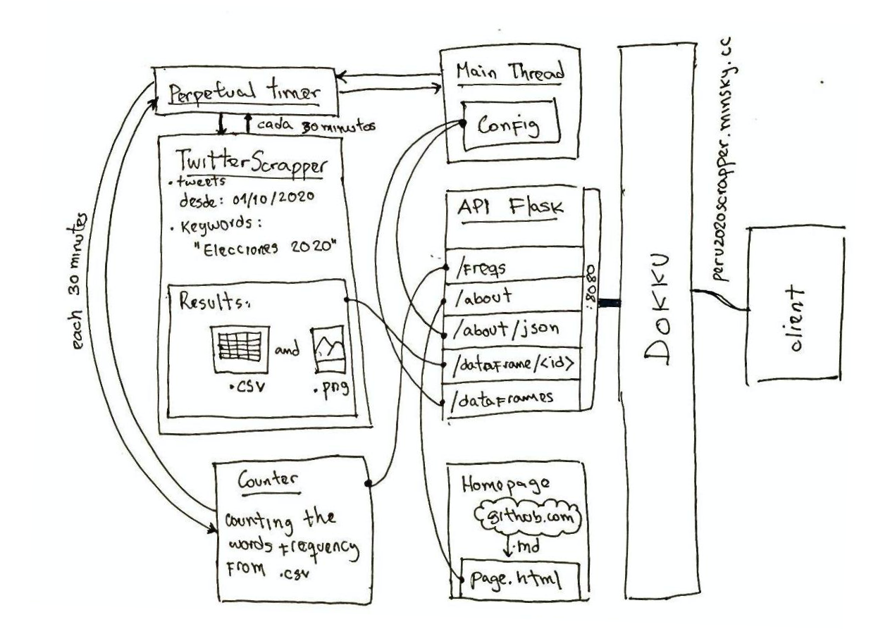
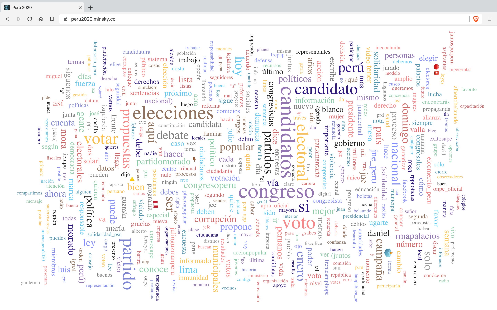

# Peru 2020 Scrapper

Peru2020Scrapper es un programa que extrae tweets relacionados a las [Elecciones Congresales Extraordinarias 2020 del Peru]([https://www.wikiwand.com/es/Elecciones_congresales_extraordinarias_de_Per%C3%BA_de_2020](https://www.wikiwand.com/es/Elecciones_congresales_extraordinarias_de_Perú_de_2020)) cada 30 minutos y pone los resultados a disposición de la comunidad en las siguientes presentaciones:

1. **Dataframes como CSV** (casos de uso: pandas con python, cualquier programa que acepte CSVs)
2. **Pequeña API REST** (casos de uso: uso directo en clientes, [ejemplo](https://peru2020.minsky.cc/) y su repositorio https://github.com/minskylab/peru2020)

## Componentes del programa

El programa tiene dos hilos importantes, el primero se encarga de gestionar el API HTTP que esta gestionada por [Flask](https://flask.palletsprojects.com/en/1.1.x/), el segundo es el hilo encargado de ejecutar cada 30 minutos la rutina de scraping y la rutina para calcular la frecuencia de palabras del último resultado del scraping. Finalmente, el hilo principal (Main Thread) se encarga de ser el punto de inicio del programa.

Veo necesario agradecer al proyecto [Twint](https://github.com/twintproject/twint). Es gracias a este framework que se puede realizar un increíble scraping a Twetter. Tambíen destaco otros proyecto relacionados: [twitterscraper](https://github.com/taspinar/twitterscraper) de [taspinar](https://github.com/taspinar) y [twitter-scraper](https://github.com/bisguzar/twitter-scraper) de [bisguzar](https://github.com/bisguzar).


Abajo puedes ver un dibujo a mano alzada de la actual arquitectura del programa.



## Uso de los dataframes

Para listar todos los dataframes disponibles usa [https://peru2020scrapper.minsky.cc/dataframes](https://peru2020scrapper.minsky.cc/dataframes)

Ejemplo

```shell 
$ curl https://peru2020scrapper.minsky.cc/dataframes
```

```json
{
  "data": [
    "/dataframe/23-01-2020_16:46.csv",
    "/dataframe/23-01-2020_08:57.csv",
    "/dataframe/23-01-2020_11:47.csv",
    ...
    "/dataframe/23-01-2020_07:20.csv",
    "/dataframe/23-01-2020_19:07.csv",
    "/dataframe/23-01-2020_10:05.csv"
  ]
}
```

Si quieres conocer el último dataframe scrapped [https://peru2020scrapper.minsky.cc/last-dataframe](https://peru2020scrapper.minsky.cc/last-dataframe).

Ejemplo

```shell 
$ curl https://peru2020scrapper.minsky.cc/last-dataframe
```

```json
{
  "data": [
    "/dataframe/23-01-2020_16:46.csv"
  ]
}
```


Una vez que tengas el nombre del dataframe a usar, para descargar el csv solo usa 

https://peru2020scrapper.minsky.cc/dataframe/**<dataframename.csv>**

Ejemplo

```shell 
$ curl https://peru2020scrapper.minsky.cc/dataframe/23-01-2020_16:46.csv
```

Uso con python y pandas

```python 
import pandas as pd
df = pd.read_csv("https://peru2020scrapper.minsky.cc/dataframe/23-01-2020_16:46.csv")
print(df["tweet"])
```

Output

```tex
0       A puertas de la elección del nuevo @congresope...
1       #Elecciones2020: #LeySeca inicia este sábado a...
2       Elecciones 2020: Multarán a quienes no cumplan...
3       Elecciones 2020: Multarán a quienes no cumplan...
4       Elecciones 2020: Multarán a quienes no cumplan...
                              ...
3207    #ELECCIONES2020 | Seguimos con nuestro \nBLOQU...
3208    Cómo te digo que repartir miles de  volantes c...
3209    Mi abuelo era añrista, yo no lo soy. Mi madre ...
3210    #Lectura #BlogPolítico Qué es la ingeniería el...
3211    #Elecciones2020 🗳️\nUna propuesta legislativa ...
Name: tweet, Length: 3212, dtype: object
```

Todo suyo, intenten usar los algoritmos modernos de NLP y Sentiment Analisis para sacar insights de esto.

## Uso del API HTTP

#### Frecuencia de palabras

Peru2020Scrapper hace un conteo de frecuencia de las palabras de todos los tweets en el último dataframe scrapeado. El endpoint para acceder a estos resultados es [https://peru2020scrapper.minsky.cc/freqs](https://peru2020scrapper.minsky.cc/freqs).

Ejemplo de uso

```shell 
$ curl https://peru2020scrapper.minsky.cc/freqs
```

```json
{
  "data": [
    {
      "text": "candidatos",
      "value": 347
    },
    {
      "text": "congreso",
      "value": 341
    },
    {
      "text": "elecciones",
      "value": 293
    },
    {
      "text": "voto",
      "value": 271
    },
    {
      "text": "partido",
      "value": 250
    },
    ...
    {
      "text": "atenta",
      "value": 2
    },
    {
      "text": "logra",
      "value": 2
    }
  ]
}
```


Un uso directo de este endpoint se puede ver en [https://peru2020.minsky.cc/](https://peru2020.minsky.cc/) que realiza una [nube de palabaras](https://www.wikiwand.com/en/Tag_cloud) con los terminos más usados en los tweets sobre las elecciones congresales. Abajo puedes ver una captura de pantalla de este programa.


